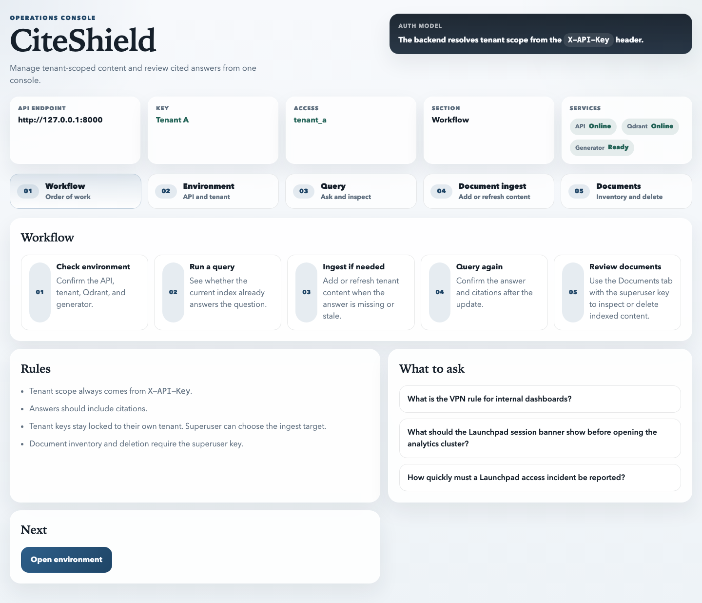
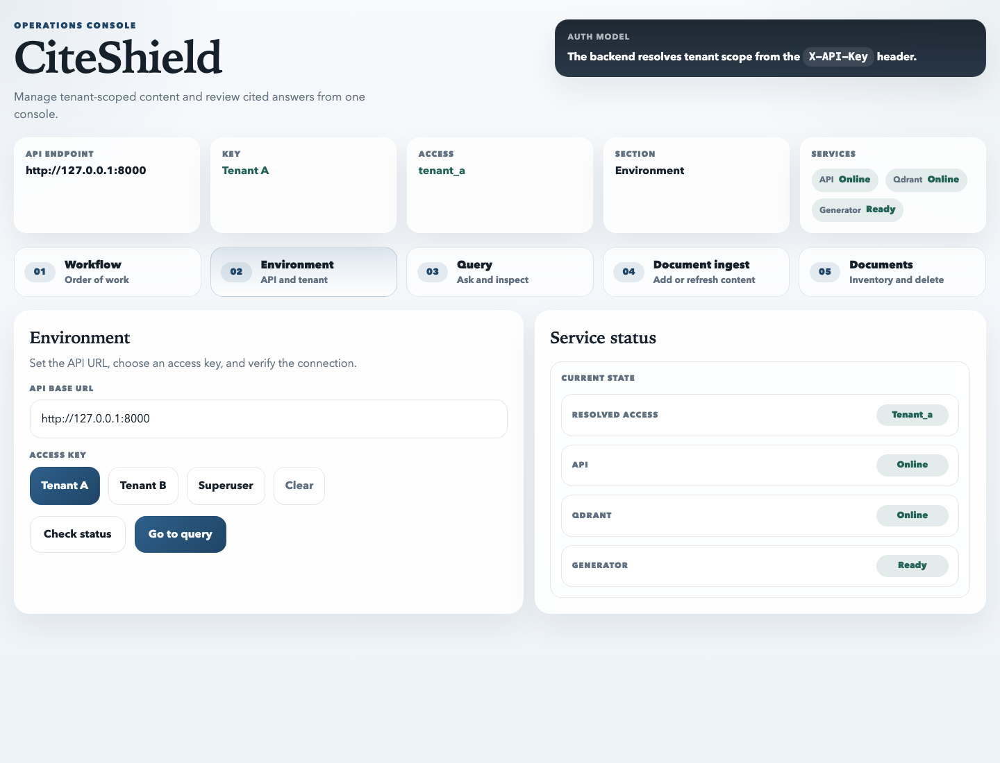
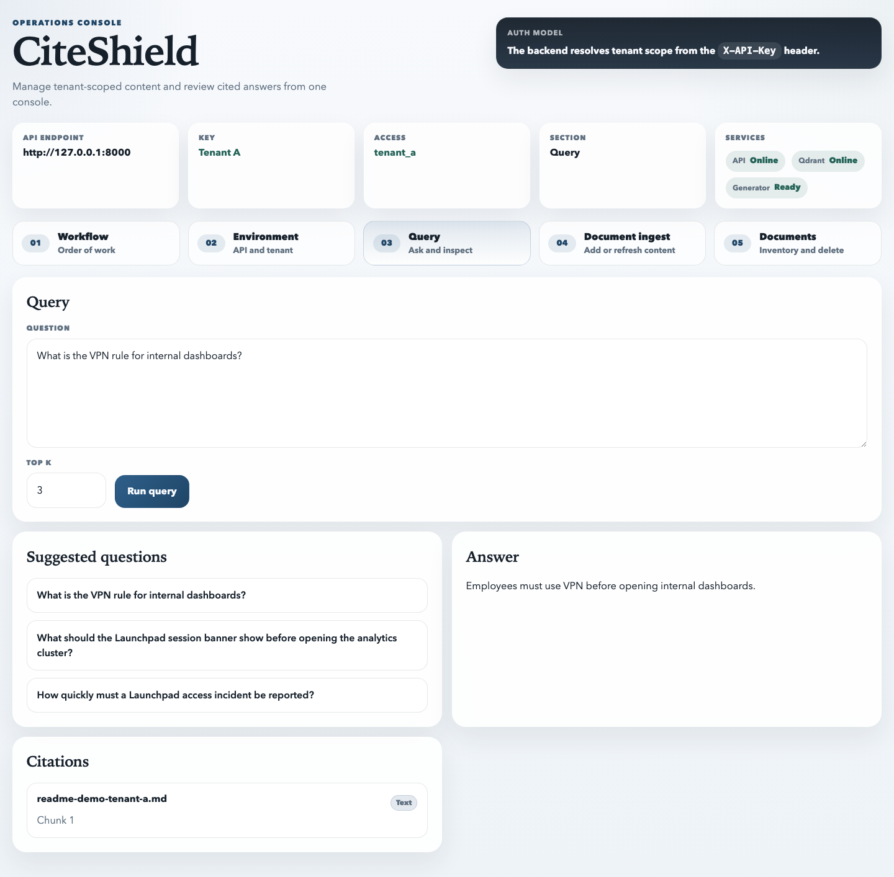
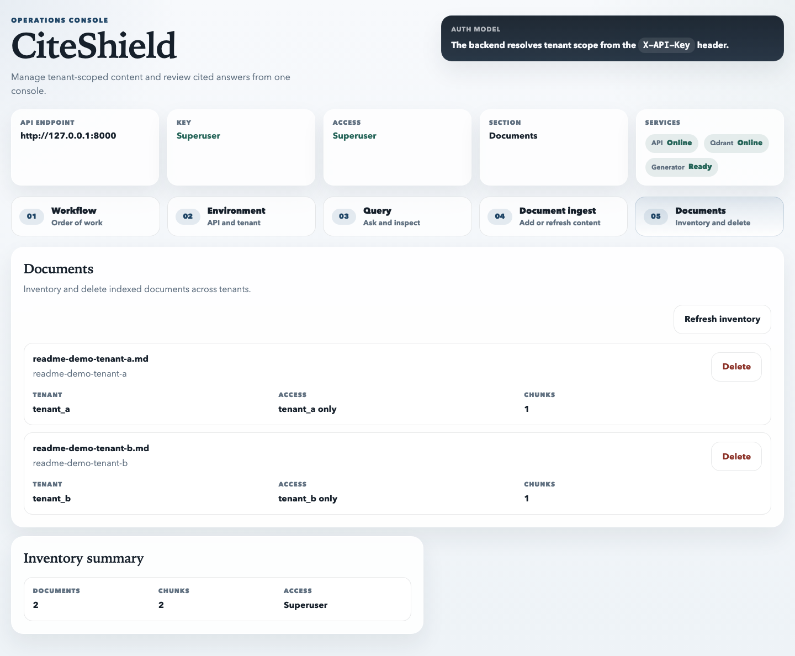
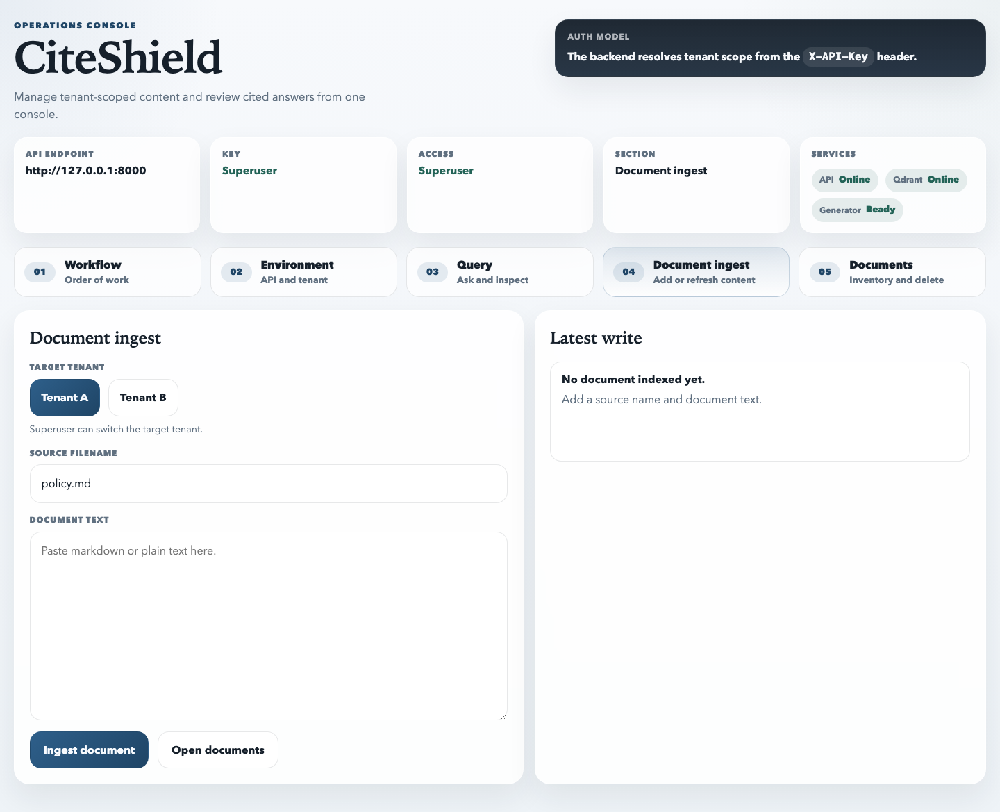

# CiteShield

CiteShield is a multi-tenant RAG prototype for operational knowledge bases. It answers tenant-scoped questions with citations, supports text-first multimodal retrieval over image, audio, and video-derived text, records request and retrieval telemetry, and includes the deployment and evaluation hooks expected from an ML platform service.

The aim of this project is to create a platform surface around RAG: isolation, reproducible startup, health checks, observability, lifecycle traces, evaluation, and Kubernetes readiness.

## At a Glance

- **Backend:** FastAPI, Qdrant, Prometheus metrics, structured request logs.
- **Frontend:** React/Vite operations console for tenant selection, ingest, query, citations, and document inventory.
- **Retrieval:** tenant-filtered vector search with offline hash embeddings or sentence-transformer embeddings.
- **Multimodal:** local OCR/ASR/video processing turns media into tenant-scoped searchable text with citations back to source assets.
- **Generation:** extractive local generator by default, with optional Gemini or OpenAI-compatible generation.
- **Tracing:** JSONL query traces by default, optional MLflow emission.
- **Deployment:** Docker Compose for local service mode, Kustomize overlays for Kubernetes.
- **Validation:** pytest, smoke tests, offline evaluation, benchmark script, Kubernetes render checks.

## Console Flow

The console starts with the operating model and tenant-scoped workflow:



The Environment tab verifies the API, Qdrant, generator, and active access key:



Tenant users can ask questions and inspect citations:



The superuser can review indexed documents across tenants:



Documents can be added or refreshed from the console:



Captured API and trace evidence is stored in `docs/assets/`:

- `health-output.json`
- `query-output.json`
- `agent-query-output.json`
- `metrics-output.txt`
- `lifecycle-query-traces.jsonl`
- `pytest-output.txt`

## How It Works

1. A request arrives with an `X-API-Key`.
2. The backend resolves that key to `tenant_a`, `tenant_b`, or `superuser`.
3. Tenant documents are chunked, embedded, and written to Qdrant with tenant metadata.
4. Queries retrieve only chunks for the active tenant.
5. The generator returns a grounded answer and citations, or abstains when context is insufficient.
6. Metrics, structured logs, and lifecycle traces are written for operational review.

`/agent/query` uses the same tenant isolation, but returns a deterministic tool trace: list tenant documents, retrieve chunks, then explain retrieval diagnostics.

## Prerequisites

- Python 3.12+
- Node.js 18+
- Docker and Docker Compose for the service-mode quickstart
- Make

For Kubernetes work, also install `kubectl` and either kind or minikube.

## Quickstart

This path starts the API and Qdrant with Docker Compose and the frontend with Vite.

```bash
cp .env.example .env
```

For a fast offline demo, set these values in `.env`:

```env
EMBEDDING_BACKEND=hash
GENERATOR_BACKEND=extractive
QDRANT_LOCAL_PATH=
```

`QDRANT_LOCAL_PATH` must stay blank for Docker Compose so the API uses the Compose `qdrant` service.

Start the backend:

```bash
make setup
make up
python scripts/smoke_test.py
```

Start the frontend:

```bash
cd frontend
npm ci
npm run dev -- --host 127.0.0.1 --port 5173
```

Open:

- API health: `http://127.0.0.1:8000/health`
- API metrics: `http://127.0.0.1:8000/metrics`
- Frontend console: `http://127.0.0.1:5173/`

Demo keys:

- Tenant A: `tenant-a-dev-key`
- Tenant B: `tenant-b-dev-key`
- Superuser: `superuser-dev-key`

Stop the backend:

```bash
make down
```

## Direct Local Run

Use this when Docker is unavailable or when you want a fast screenshot loop. This mode uses embedded Qdrant storage and does not require a Qdrant server.

Terminal 1:

```bash
EMBEDDING_BACKEND=hash \
GENERATOR_BACKEND=extractive \
QDRANT_LOCAL_PATH=artifacts/qdrant_local_demo \
LIFECYCLE_TRACKING_PATH=artifacts/lifecycle_runs.jsonl \
python -m uvicorn app.main:app --host 127.0.0.1 --port 8000
```

Terminal 2:

```bash
cd frontend
npm ci
npm run dev -- --host 127.0.0.1 --port 5173
```

Embedded Qdrant local mode is single-process. Do not run another ingestion script against the same `QDRANT_LOCAL_PATH` while the API is running.

## Try the API

Ingest a tenant document:

```bash
curl -sS -X POST http://127.0.0.1:8000/ingest \
  -H 'Content-Type: application/json' \
  -H 'X-API-Key: tenant-a-dev-key' \
  -d '{"source":"readme-demo-tenant-a.md","text":"Employees must use VPN before opening internal dashboards. Launchpad access incidents must be reported within 15 minutes."}'
```

Ask a question:

```bash
curl -sS -X POST http://127.0.0.1:8000/query \
  -H 'Content-Type: application/json' \
  -H 'X-API-Key: tenant-a-dev-key' \
  -H 'X-Request-ID: readme-demo-query' \
  -d '{"question":"What is the VPN rule for internal dashboards?","top_k":3}'
```

Expected shape:

```json
{
  "answer": "Employees must use VPN before opening internal dashboards.",
  "citations": [
    {
      "source": "readme-demo-tenant-a.md",
      "chunk_id": 0
    }
  ]
}
```

Run the agent endpoint when you want diagnostics:

```bash
curl -sS -X POST http://127.0.0.1:8000/agent/query \
  -H 'Content-Type: application/json' \
  -H 'X-API-Key: tenant-a-dev-key' \
  -d '{"question":"How quickly must a Launchpad access incident be reported?","top_k":3,"include_diagnostics":true}'
```

## Logs, Metrics, and Traces

Direct `uvicorn` logs print in the API terminal as structured JSON. Query logs include the request id, tenant id, route, retrieval latency, generation latency, citation count, abstention flag, and status code. They intentionally exclude raw questions, document text, and API keys.

Docker logs:

```bash
docker compose -f deploy/docker/compose.yaml logs -f api
```

Metrics:

```bash
curl -sS http://127.0.0.1:8000/metrics
```

Useful metric names:

- `rag_requests_total`
- `rag_ingest_total`
- `rag_indexed_chunks`
- `rag_retrieval_latency_seconds`
- `rag_generation_latency_seconds`
- `rag_citations_total`
- `rag_citation_count`
- `rag_query_top_k`

Lifecycle traces:

```bash
tail -f artifacts/lifecycle_runs.jsonl
```

Each query trace records the tenant, route, retrieved sources, retrieval and generation latency, citation count, abstention flag, embedding backend, generator backend, and MLflow status. JSONL tracing is always available. To also emit to MLflow, install `requirements-mlflow.txt` and set `MLFLOW_TRACKING_URI`.

## Generation Backends

| Backend | Use case | Required settings |
|---|---|---|
| `extractive` | Offline demos, tests, deterministic evaluation | `GENERATOR_BACKEND=extractive` |
| `gemini` | Hosted LLM generation with grounded JSON responses | `GENERATOR_BACKEND=gemini`, `GEMINI_API_KEY` |
| `openai_compatible` | vLLM, local gateways, Ollama-compatible `/v1` servers | `GENERATOR_BACKEND=openai_compatible`, `OPENAI_COMPATIBLE_BASE_URL`, `OPENAI_COMPATIBLE_MODEL` |

Ollama is optional. If your local Ollama server exposes an OpenAI-compatible endpoint, use:

```env
GENERATOR_BACKEND=openai_compatible
OPENAI_COMPATIBLE_BASE_URL=http://127.0.0.1:11434/v1
OPENAI_COMPATIBLE_MODEL=<installed-ollama-model>
GENERATOR_ENABLE_FALLBACK=true
```

## Multimodal RAG

CiteShield supports text-first multimodal retrieval. Image, audio, and video samples are processed locally into derived Markdown, then indexed into the same tenant-isolated Qdrant collection. Citations can point back to the source media path.

```bash
python -m pip install -r requirements-multimodal.txt
brew install tesseract ffmpeg
make multimodal-demo
```

See [docs/multimodal.md](docs/multimodal.md) for data layout, OCR/ASR behavior, citation metadata, and licensing notes.

## Kubernetes

Kubernetes manifests live under:

- `deploy/k8s/base/`
- `deploy/k8s/overlays/local/`
- `deploy/k8s/overlays/local-with-monitoring/`
- `deploy/k8s/overlays/prod-template/`

Render or deploy the local overlay:

```bash
kubectl kustomize deploy/k8s/overlays/local
make k8s-deploy
make k8s-smoke
```

The local overlay uses hash embeddings for offline-safe validation. Production secrets must be created out of band; do not commit real `.env` files, API keys, tokens, or passwords.

## Verification

Run these before publishing changes:

```bash
python -m pytest -q
npm --prefix frontend run build
make eval
make benchmark
docker compose -f deploy/docker/compose.yaml config
kubectl kustomize deploy/k8s/overlays/local
kubectl kustomize deploy/k8s/overlays/local-with-monitoring
kubectl kustomize deploy/k8s/overlays/prod-template
```

Captured test output is included in `docs/assets/pytest-output.txt`.

## Documentation

- [Local quickstart](docs/local_quickstart.md)
- [Observability](docs/observability.md)
- [Manual configuration](docs/manual_configuration.md)
- [Operations runbook](docs/operations_runbook.md)
- [Kubernetes quickstart](docs/kubernetes_quickstart.md)
- [LLM serving backends](docs/llm_serving_backends.md)
- [Agent mode](docs/agent_mode.md)
- [Multimodal RAG](docs/multimodal.md)
- [Model lifecycle](docs/model_lifecycle.md)
- [Threat model](docs/threat_model.md)
- [Limitations](docs/limitations.md)
