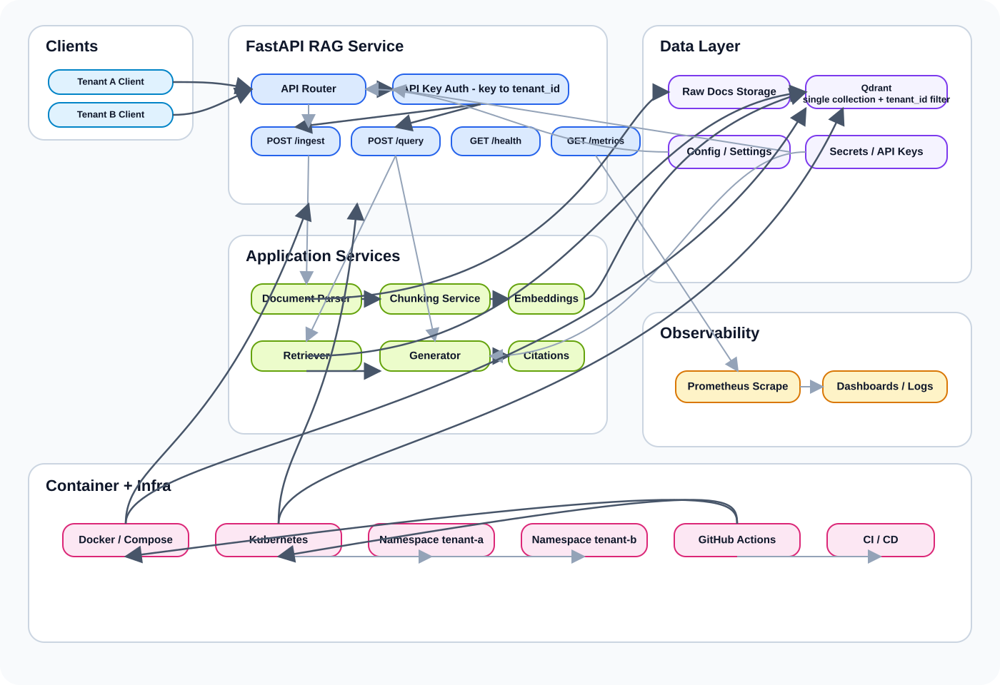
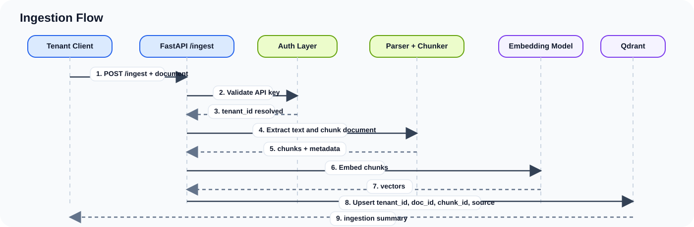
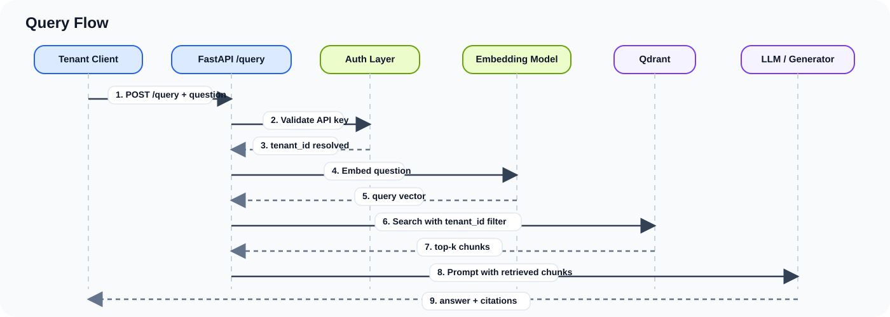
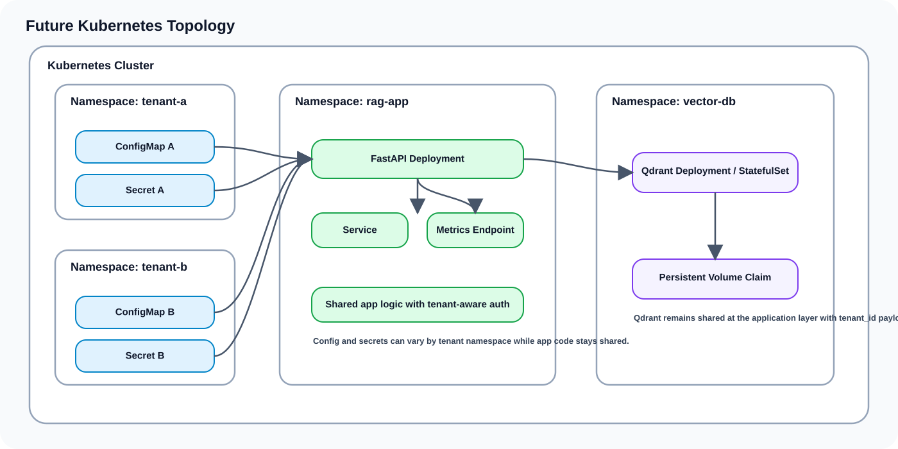
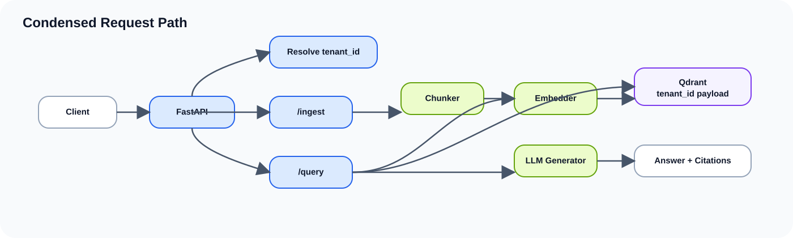

# CiteShield

CiteShield is a multi-tenant Retrieval-Augmented Generation (RAG) service built to answer questions with citations while enforcing tenant isolation. The project is intentionally being built in controlled passes so the application works before the infrastructure becomes complicated.

## Project Goal

Build a small but credible backend system that demonstrates:

- tenant-aware document ingestion
- tenant-filtered retrieval
- grounded answer generation with citations
- API-key-based tenant resolution
- metrics and health reporting
- containerized local development
- Kubernetes manifests and CI as follow-on layers

## Build It In Passes

This project will be developed in the following order:

- [x] RAG core works
- [x] tenant isolation works
- [x] packaging and metrics work
- [x] Kubernetes and CI work

The operating rule for this repo is simple: application correctness comes before deployment complexity.

## Version 1 Scope

Version 1 is intentionally narrow:

- exactly 2 tenants: `tenant_a` and `tenant_b`
- text and markdown documents only
- 3 to 5 documents per tenant
- `top_k = 3`
- answers must include citations
- no OCR
- no UI
- no reranker
- no hybrid search
- no RBAC
- no Helm in the first iteration

## Core Design Decisions

- FastAPI will provide the API surface and dependency-based auth flow.
- Qdrant will be used as a shared vector store with one collection and a `tenant_id` payload filter.
- Tenant identity will be resolved server-side from API keys, never trusted from client input.
- Retrieval and generation will stay decoupled so the answer layer can be swapped without rewriting the retrieval layer.
- Metrics and deployment concerns will be added only after ingestion, retrieval, and isolation are proven locally.

## Planned Stack

- API framework: FastAPI
- Vector store: Qdrant
- Embeddings: Sentence Transformers
- Local packaging: Docker Compose
- Orchestration: Kubernetes
- CI: GitHub Actions
- Metrics: Prometheus-compatible `/metrics`

## Environment

The project uses a repo-local conda environment at `.conda/` so dependency state stays isolated from the system Python.

- Python target: `3.14.4`
- Recreate the environment: `conda env create -p ./.conda -f environment.yml`
- Update it after dependency changes: `conda env update -p ./.conda -f environment.yml --prune`
- Activate it from the repo root: `conda activate "$(pwd)/.conda"`
- `environment.yml` pins the direct dependency versions for the conda workflow
- `requirements.txt` mirrors the direct Python dependencies for users who prefer `venv` + `pip`
- full conda locking is intentionally deferred until the project is further along

Initial packages included so far:

- `fastapi`
- `uvicorn[standard]`
- `qdrant-client`
- `sentence-transformers`
- `prometheus-client`
- `pydantic-settings`
- `python-multipart`
- `pytest`
- `httpx`

## Status

| Area | Status | Notes |
| --- | --- | --- |
| README | In progress | Living document initialized |
| App scaffold | Completed | Repo skeleton created and the FastAPI app is wired with health, ingest, query, and metrics routes |
| Vector store bootstrap | Completed | Live Docker Qdrant verified with `documents` and `tenant_id` keyword payload index |
| Ingestion | Completed | One script loads both tenants, chunks docs, embeds text, and stores chunk payloads in Qdrant |
| Retrieval | Completed | `POST /query` embeds the question and searches Qdrant with a mandatory tenant filter |
| Generation | Completed | `POST /query` now returns grounded answers plus citations from retrieved chunks |
| Auth and isolation | Completed | `X-API-Key` maps server-side to `tenant_a` or `tenant_b`; client `tenant_id` claims are ignored |
| Metrics | Completed | `/metrics` exposes Prometheus counters, histogram, and indexed chunk gauge |
| Health | Completed | `/health` returns plain JSON for API, Qdrant, and generator readiness |
| Testing | Completed | Explicit tests cover health, ingest, query, isolation, generator behavior, vector-store bootstrap, and metrics |
| Evaluation | Completed | `scripts/evaluate.py` runs built-in QA checks and writes a CSV report |
| Packaging | Completed | Dockerfile and Docker Compose verified with live `api + qdrant` services |
| Kubernetes | Completed | MVP manifests added for shared app, vector DB, ConfigMap, Secret, Deployment, Service, tenant overlay namespaces, and ResourceQuota |
| CI | Completed | GitHub Actions runs tests on push and pull request and builds the Docker image without pushing |

## Target Architecture

The diagrams below describe the intended target state for the project. They are here to keep implementation aligned as the repo evolves.

Static SVGs are embedded instead of live Mermaid blocks because Mermaid rendering is inconsistent across Markdown viewers and IDE previews.

### System Overview



### Ingestion Flow



### Query Flow



### Future Kubernetes Topology



### Condensed Request Path



## Application Model

At runtime, the core request path is expected to look like this:

1. A client sends a request with `X-API-Key`.
2. FastAPI resolves that key to a server-side tenant context.
3. `/ingest` parses, chunks, embeds, and stores chunks in Qdrant with tenant metadata.
4. `/query` embeds the question, searches with a tenant filter, and passes the retrieved chunks to the answer generator.
5. The API returns an answer plus citations tied to the retrieved chunks.

## Tenant Isolation Rules

These rules are non-negotiable:

- every stored chunk must carry `tenant_id`
- every search must apply a tenant filter
- the client must never choose its own tenant identity
- API keys map to tenants server-side
- cross-tenant retrieval must fail by construction, not by convention

## Planned API Surface

The initial API surface is intentionally small:

- `GET /health` returns service health with `status`, `qdrant`, and `generator`
- `POST /ingest` ingests one tenant-scoped text/markdown document for the authenticated tenant
- `POST /query` returns answers and citations for the authenticated tenant
- `GET /metrics` exposes Prometheus-style metrics

## Authentication

Step 6 adds server-side tenant resolution through `X-API-Key`.

- Header name: `X-API-Key`
- Default local dev keys:
  - `tenant-a-dev-key` -> `tenant_a`
  - `tenant-b-dev-key` -> `tenant_b`
- These defaults are for local development only and should be overridden via environment variables outside the repo
- Client-supplied `tenant_id` values in request bodies are ignored; the tenant comes only from the authenticated key
- Missing or invalid keys return `401`

## Local Qdrant

Step 2 uses one shared Qdrant collection named `documents`.

- Start Qdrant locally with Docker: `./scripts/run_qdrant.sh`
- Qdrant is bound to `127.0.0.1` only and should not be exposed publicly
- Initialize the collection and payload index: `./.conda/bin/python scripts/init_qdrant.py`
- For client-only verification without Docker: `./.conda/bin/python scripts/init_qdrant.py --local-path /tmp/citeshield-qdrant`
- Qdrant local mode does not enforce payload indexes, so real `tenant_id` index verification still requires the server process

Current collection bootstrap assumptions:

- collection name: `documents`
- vector size: `384`
- distance metric: `cosine`
- required payload index: `tenant_id` as a keyword field
- expected chunk payload fields: `tenant_id`, `doc_id`, `chunk_id`, `source`, `text`, `page`, `line_range`

## Ingestion

Step 3 and Step 6 together now support both script-based and API-based ingestion:

- Run ingestion against the live Docker Qdrant server: `./.conda/bin/python scripts/ingest_sample_docs.py`
- The script reads from `data/tenant_a/` and `data/tenant_b/`
- It chunks markdown/text documents, embeds each chunk, and upserts them into `documents`
- Stored payload fields currently include `tenant_id`, `doc_id`, `chunk_id`, `source`, `text`, and `line_range`
- API ingestion is available at `POST /ingest` with body fields:
  - `source`
  - `text`
- The API route derives `doc_id` from `source` and always stores the document under the tenant resolved from `X-API-Key`

Quick verification commands:

- Inspect the collection: `curl http://127.0.0.1:6333/collections/documents`
- Inspect stored payloads: `./.conda/bin/python -c "from qdrant_client import QdrantClient; client=QdrantClient(url='http://127.0.0.1:6333'); print(client.scroll(collection_name='documents', limit=10, with_payload=True, with_vectors=False)[0])"`

## Retrieval

Step 4 is implemented as the retrieval half of `POST /query`:

- Run a live query: `./.conda/bin/python -c "from fastapi.testclient import TestClient; from app.main import app; print(TestClient(app).post('/query', json={'question':'What is the VPN rule?','top_k':3}, headers={'X-API-Key':'tenant-a-dev-key'}).json())"`
- The endpoint embeds the question, applies a mandatory Qdrant filter on `tenant_id`, and retrieves the top matching chunks

## Generation

Step 5 adds a swappable generator behind a small interface:

- `generate_answer(question, retrieved_chunks) -> AnswerWithCitations`
- The current backend is extractive rather than external-LLM-based, so the project stays runnable without model-serving or API-key setup
- The generator only uses retrieved chunk text, prefers sentences that overlap the question terms, and abstains when the retrieved context is too weak
- `POST /query` now returns:
  - `answer`
  - `citations` with `source` and `chunk_id`

## Metrics

Step 7 exposes `GET /metrics` with Prometheus-compatible instrumentation:

- `rag_requests_total`
- `rag_ingest_total`
- `rag_retrieval_errors_total`
- `rag_request_latency_seconds`
- `rag_indexed_chunks`

Label choices stay intentionally low-cardinality:

- allowed labels: `route`, `method`, `status_code`
- disallowed labels: `tenant_id`, `doc_id`, user IDs, free-form text

Current behavior:

- request counts and latency are captured for API calls
- successful `POST /ingest` calls increment `rag_ingest_total`
- retrieval exceptions increment `rag_retrieval_errors_total`
- `rag_indexed_chunks` is refreshed from Qdrant during `/metrics` scrapes

## Health

Step 8 keeps `GET /health` intentionally small:

- healthy response shape:
  - `status`
  - `qdrant`
  - `generator`
- example healthy payload:
  - `{"status":"ok","qdrant":"ok","generator":"configured"}`
- if Qdrant is unreachable or the generator backend is misconfigured, the endpoint returns `503` with `status: "degraded"`

## Testing

Step 9 adds explicit coverage for the pre-packaging contract:

- `/health` returns `200` when dependencies are healthy
- ingest works for tenant A
- ingest works for tenant B
- query for tenant A returns only tenant A citations
- query for tenant B returns only tenant B citations
- invalid or missing API keys return `401`
- malicious requests that pretend to be another tenant still fail
- dependency overrides are used in tests so routes can be exercised against local Qdrant instances and deterministic embedders

## Evaluation

Step 10 adds a tiny evaluation script at `scripts/evaluate.py`.

- built-in cases:
  - 5 QA pairs for tenant A
  - 5 QA pairs for tenant B
  - 2 negative cross-tenant checks
- tracked fields per case:
  - retrieval hit@k
  - answer abstained or not
  - citation present or not
  - latency in milliseconds
- output:
  - CSV written by default to `artifacts/evaluation_results.csv`
  - summary printed to stdout as JSON

Example usage:

- evaluate against the live Qdrant server after re-ingesting sample docs:
  - `./.conda/bin/python scripts/evaluate.py`
- evaluate against local Qdrant mode:
  - `HF_HUB_OFFLINE=1 TRANSFORMERS_OFFLINE=1 ./.conda/bin/python scripts/evaluate.py --local-path /tmp/citeshield-eval`
- evaluate an existing index without re-ingesting:
  - `./.conda/bin/python scripts/evaluate.py --skip-ingest`

## Docker Compose

Step 11 packages the application for local containerized development.

- build and start the API and Qdrant stack:
  - `docker compose -f deploy/docker/compose.yaml up --build -d`
- stop the stack:
  - `docker compose -f deploy/docker/compose.yaml down`
- inspect running services:
  - `docker compose -f deploy/docker/compose.yaml ps`

Current Compose behavior:

- `deploy/docker/Dockerfile` builds a FastAPI image on `python:3.14-slim`
- the API service listens on `127.0.0.1:8000`
- the Qdrant service is kept on the internal Compose network and is not published to the host
- `qdrant_storage` persists vector data across restarts
- `model_cache` persists the embedding model cache across restarts
- tenant API keys are configurable through environment variables:
  - `TENANT_A_API_KEY`
  - `TENANT_B_API_KEY`

Compose verification examples:

- ingest as tenant A:
  - `curl -X POST http://127.0.0.1:8000/ingest -H 'Content-Type: application/json' -H 'X-API-Key: tenant-a-dev-key' --data-raw '{"source":"compose_policy_a.md","text":"Tenant A analysts must use the corporate VPN before opening internal dashboards."}'`
- ingest as tenant B:
  - `curl -X POST http://127.0.0.1:8000/ingest -H 'Content-Type: application/json' -H 'X-API-Key: tenant-b-dev-key' --data-raw '{"source":"compose_policy_b.md","text":"Tenant B refund requests are approved by the billing operations team."}'`
- query as tenant A:
  - `curl -X POST http://127.0.0.1:8000/query -H 'Content-Type: application/json' -H 'X-API-Key: tenant-a-dev-key' --data-raw '{"question":"How do analysts use VPN for internal dashboards?","top_k":3}'`
- query as tenant B:
  - `curl -X POST http://127.0.0.1:8000/query -H 'Content-Type: application/json' -H 'X-API-Key: tenant-b-dev-key' --data-raw '{"question":"Who approves refund requests?","top_k":3}'`
- health:
  - `curl http://127.0.0.1:8000/health`
- metrics:
  - `curl http://127.0.0.1:8000/metrics`

## Kubernetes

Step 12 adds an MVP Kubernetes layer under `deploy/k8s/`.

Current design:

- shared app namespace: `rag-app`
- shared vector database namespace: `vector-db`
- tenant overlay namespaces: `tenant-a`, `tenant-b`
- shared Qdrant collection remains the tenant-isolation mechanism at the application layer
- tenant namespaces provide config separation plus small namespace-level quotas

Manifest files:

- `deploy/k8s/namespace.yaml`
  - creates `rag-app`, `vector-db`, `tenant-a`, and `tenant-b`
- `deploy/k8s/configmap.yaml`
  - stores non-secret config such as chunk size, top-k, model name, generator settings, feature flags, and Qdrant host information
- `deploy/k8s/secret.yaml`
  - stores tenant API keys and an external LLM key placeholder
- `deploy/k8s/deployment.yaml`
  - deploys the FastAPI app in `rag-app`
  - deploys Qdrant plus a persistent volume claim in `vector-db`
- `deploy/k8s/service.yaml`
  - exposes the API and Qdrant internally as `ClusterIP` services
- `deploy/k8s/quota.yaml`
  - adds small `ResourceQuota` objects for `tenant-a` and `tenant-b`

Apply order:

- create namespaces:
  - `kubectl apply -f deploy/k8s/namespace.yaml`
- create config and secrets:
  - `kubectl apply -f deploy/k8s/configmap.yaml`
  - `kubectl apply -f deploy/k8s/secret.yaml`
- create workloads and services:
  - `kubectl apply -f deploy/k8s/deployment.yaml`
  - `kubectl apply -f deploy/k8s/service.yaml`
- create tenant quotas:
  - `kubectl apply -f deploy/k8s/quota.yaml`

Operational notes:

- the API Deployment expects an image named `citeshield-api:latest`
- for a remote cluster, push that image to a registry and change the image reference in `deploy/k8s/deployment.yaml`
- for a local cluster like kind or minikube, load the local image into the cluster before applying the Deployment
- the API uses the cross-namespace Qdrant service DNS name `citeshield-qdrant.vector-db.svc.cluster.local`
- Qdrant storage is backed by a persistent volume claim named `citeshield-qdrant-storage`
- `deploy/k8s/quota.yaml` limits aggregate tenant-namespace usage for config objects, pods, services, PVCs, and requested/limited compute

## GitHub Actions

Step 14 adds a CI workflow at `.github/workflows/ci.yaml`.

Current workflow behavior:

- triggers on:
  - `push`
  - `pull_request`
- test job:
  - checks out the repo
  - sets up Python `3.14`
  - installs CPU-only PyTorch plus the pinned Python dependencies from `requirements.txt`
  - runs `python -m pytest -q`
- docker job:
  - runs after tests pass
  - builds the API image from `deploy/docker/Dockerfile`
  - does not push to any registry

## Planned Repository Shape

This is the target structure the repo will grow into:

```text
CiteShield/
  app/
    main.py
    config.py
    auth.py
    models.py
    metrics.py
    routes/
      health.py
      ingest.py
      query.py
    services/
      chunking.py
      embeddings.py
      vector_store.py
      retriever.py
      generator.py
  scripts/
    ingest_sample_docs.py
    evaluate.py
  tests/
    test_health.py
    test_ingest.py
    test_query.py
    test_isolation.py
  data/
    tenant_a/
    tenant_b/
  deploy/
    docker/
      Dockerfile
      compose.yaml
    k8s/
      namespace.yaml
      configmap.yaml
      secret.yaml
      deployment.yaml
      service.yaml
      quota.yaml
  .github/workflows/ci.yaml
  README.md
```

## Delivery Order

The implementation order for this project will be:

1. `GET /health`
2. ingestion pipeline
3. retrieval pipeline
4. answer generation with citations
5. authentication and tenant isolation
6. tests
7. metrics
8. Docker and Compose
9. Kubernetes manifests
10. GitHub Actions CI

## Definition Of Done For The First Credible Version

The project will count as minimally complete when a reviewer can:

1. start the app locally with Docker Compose
2. ingest documents for `tenant_a` and `tenant_b`
3. query as tenant A and receive only tenant A citations
4. query as tenant B and receive only tenant B citations
5. call `GET /health`
6. call `GET /metrics`
7. run tests in CI
8. inspect Kubernetes manifests covering config, secrets, namespaces, and quotas

## Non-Goals For Early Passes

The following are deliberately excluded from the first iterations:

- frontend UI
- OCR pipelines
- hybrid search
- reranking
- advanced RBAC
- per-user vector collections
- public exposure of Qdrant
- premature Kubernetes-first development

## README Maintenance

This README is intended to evolve with the project. As implementation starts, it should be updated with:

- actual setup and run instructions
- environment variables
- API examples
- testing commands
- deployment notes
- architecture changes and tradeoffs
